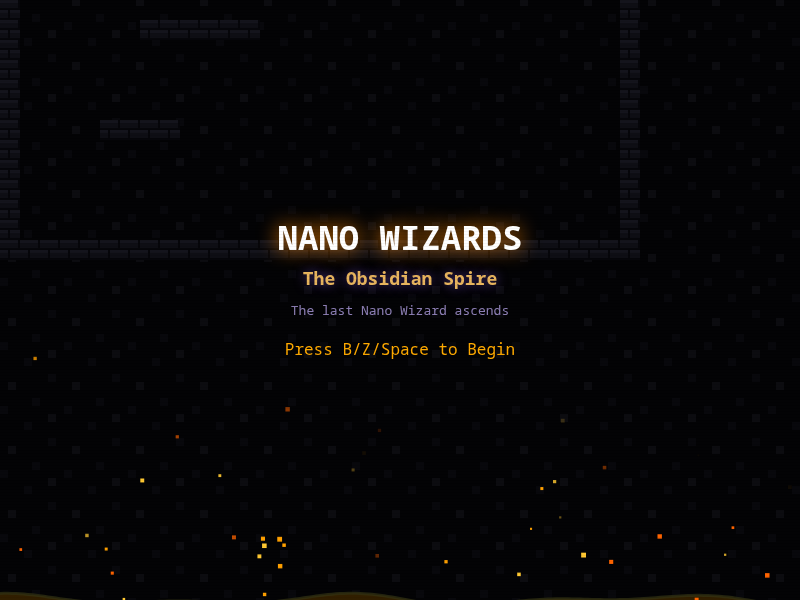
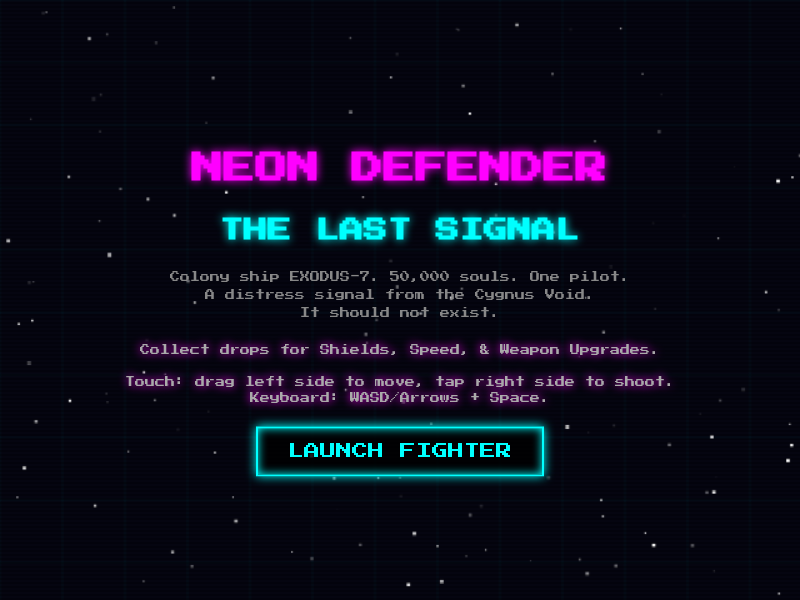
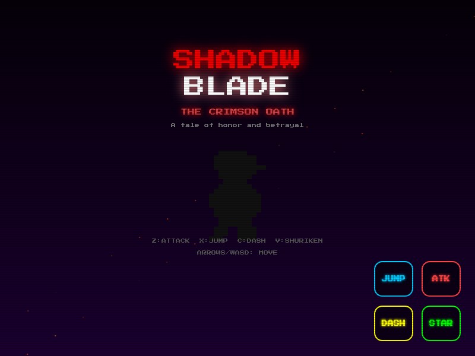
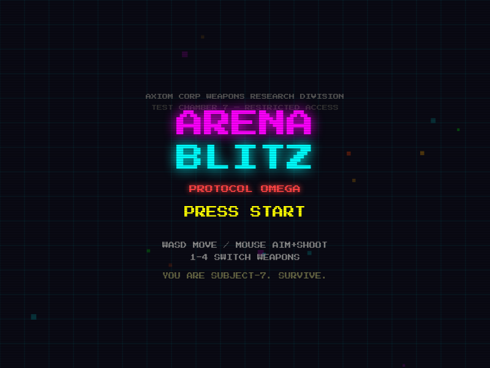
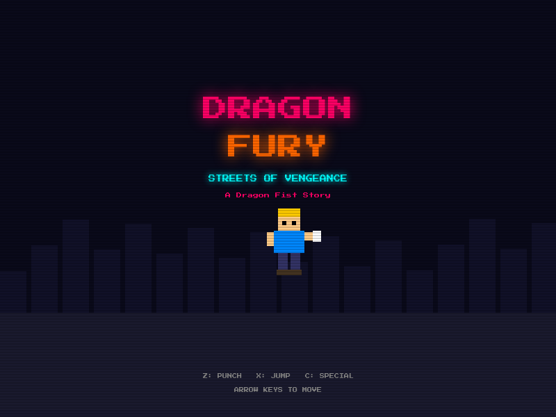
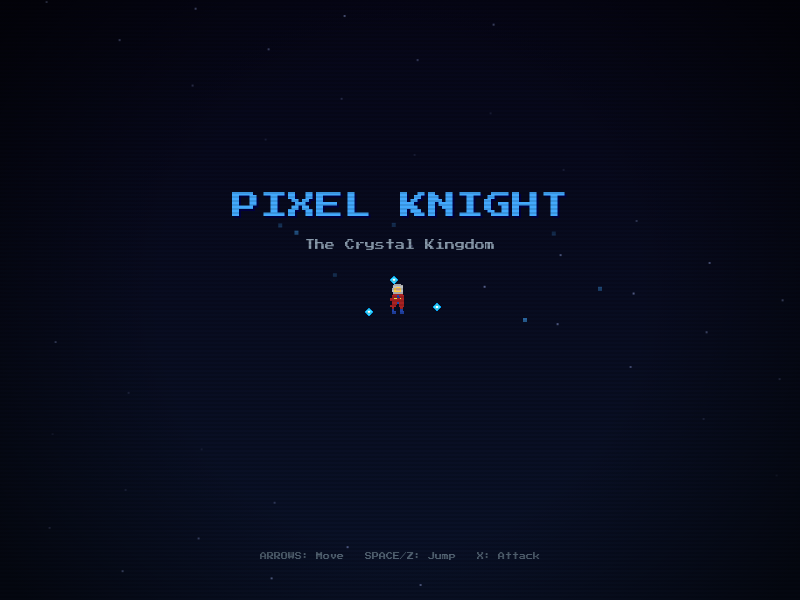
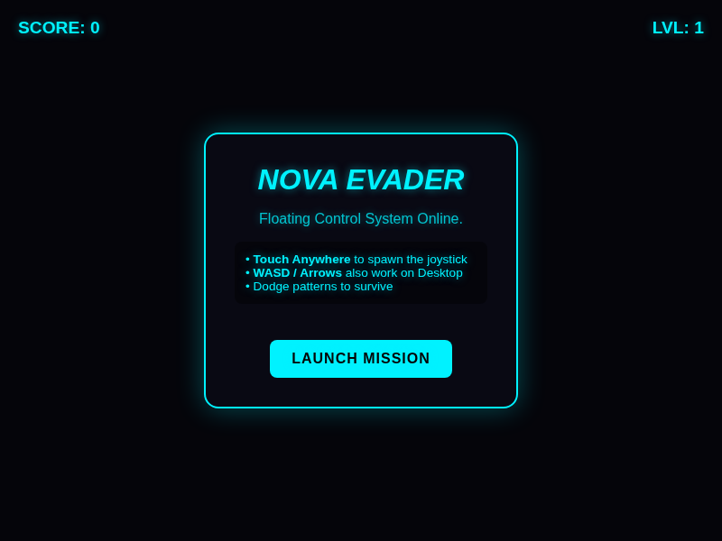
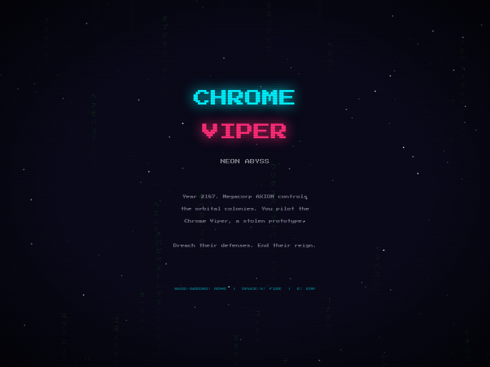
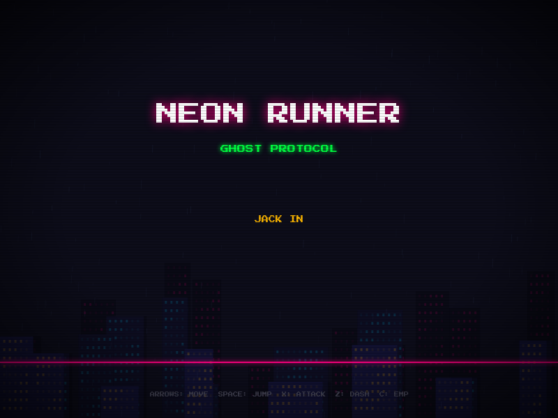

# Retro Arcade

A collection of retro browser games playable on any device, with native ports for the Miyoo Mini Plus handheld. Installable as a PWA for offline play.

## Games

| Game | Genre | Web | Miyoo |
|------|-------|:---:|:-----:|
| Nano Wizards | Platformer | [Play](web/micro/) | [Port](miyoo/micro/) |
| Neon Defender | Shoot 'em Up | [Play](web/space/) | [Port](miyoo/space/) |
| Shadow Blade | Action Platformer | [Play](web/shadow/) | [Port](miyoo/shadow/) |
| Arena Blitz | Twin-Stick Shooter | [Play](web/arena/) | [Port](miyoo/arena/) |
| Dragon Fury | Beat 'em Up | [Play](web/dragon/) | [Port](miyoo/dragon/) |
| Pixel Knight | Mario-like Platformer | [Play](web/mariolike/) | [Port](miyoo/mariolike/) |
| Nova Evader | Bullet Hell | [Play](web/nova/) | — |
| Chrome Viper | Cyberpunk Shooter | [Play](web/cyber/) | [Port](miyoo/cyber/) |
| Neon Runner | Cyberpunk Platformer | [Play](web/neon/) | [Port](miyoo/neon/) |

### Screenshots

| | | |
|:---:|:---:|:---:|
|  |  |  |
| Nano Wizards | Neon Defender | Shadow Blade |
|  |  |  |
| Arena Blitz | Dragon Fury | Pixel Knight |
|  |  |  |
| Nova Evader | Chrome Viper | Neon Runner |

## Features

- Single-file HTML5 Canvas games — no dependencies, no build step
- Fullscreen mobile with floating touch joystick (Brawl Stars-style)
- Installable as a PWA with offline caching
- Procedural pixel-art sprites and Web Audio API sound effects
- CRT scanline overlay and retro aesthetic
- Miyoo Mini Plus native ports in Rust/Macroquad

## Quick Start

### Play in browser
```bash
cd web && python3 -m http.server 8000
# Open http://localhost:8000
```

### Deploy with Docker + Tailscale
```bash
cp .env.example .env  # Add your TS_AUTHKEY
./scripts/deploy.sh
```

### Build Miyoo ports
```bash
./scripts/build-miyoo.sh all --native    # Desktop testing
./scripts/build-miyoo.sh all --arm       # Cross-compile for Miyoo
```

## Scripts

| Script | Description |
|--------|-------------|
| `scripts/deploy.sh` | Build & deploy Docker containers |
| `scripts/status.sh` | Check deployment health |
| `scripts/logs.sh` | View container logs |
| `scripts/test.sh` | Run Playwright smoke tests |
| `scripts/check-rust.sh` | Cargo check all Miyoo ports |
| `scripts/build-miyoo.sh` | Build Miyoo binaries |

## Architecture

```
retrogames/
├── web/              # Browser games (HTML5 Canvas)
│   ├── index.html    # Arcade launcher
│   ├── micro/        # Nano Wizards
│   ├── space/        # Neon Defender
│   ├── shadow/       # Shadow Blade
│   ├── arena/        # Arena Blitz
│   ├── dragon/       # Dragon Fury
│   ├── mariolike/    # Pixel Knight
│   ├── nova/         # Nova Evader
│   ├── cyber/        # Chrome Viper
│   ├── neon/         # Neon Runner
│   ├── sw.js         # Service worker (PWA)
│   └── manifest.json # PWA manifest
├── miyoo/            # Miyoo Mini Plus ports (Rust/Macroquad)
├── scripts/          # Automation scripts
├── docs/             # Comprehensive documentation
├── .claude/          # Claude Code skills & agents
├── Dockerfile        # busybox httpd static server
└── docker-compose.yml # Tailscale + app stack
```

## Documentation

Detailed guides in [`docs/`](docs/):

- [Architecture](docs/architecture.md) — system design and data flow
- [Game Engine Patterns](docs/game-engine-patterns.md) — game loop, sprites, physics
- [Deployment Guide](docs/deployment-guide.md) — Docker + Tailscale setup
- [Adding Games](docs/adding-games.md) — step-by-step tutorial
- [Mobile Optimization](docs/mobile-optimization.md) — touch controls, viewport
- [Miyoo Porting Guide](docs/miyoo-porting-guide.md) — Rust/Macroquad patterns
- [Skills & Agents](docs/skills-and-agents.md) — Claude Code automation

## Building for Miyoo Mini Plus

Each game under `miyoo/<game>/` is an independent Rust/Macroquad project targeting `armv7-unknown-linux-gnueabihf`.

```bash
rustup target add armv7-unknown-linux-gnueabihf
sudo apt-get install gcc-arm-linux-gnueabihf

cd miyoo/<game>
CARGO_TARGET_ARMV7_UNKNOWN_LINUX_GNUEABIHF_LINKER=arm-linux-gnueabihf-gcc \
  cargo build --release --target armv7-unknown-linux-gnueabihf
```

## CI/CD

GitHub Actions (`.github/workflows/build-and-publish-release.yml`) auto-discovers `miyoo/*/` subdirectories, cross-compiles each in parallel, and publishes to GitHub Releases on `v*` tags.

```bash
git tag v2.1.0
git push origin v2.1.0
```

## Tech Stack

| Layer | Technology |
|-------|-----------|
| Browser games | HTML5 Canvas, Web Audio API, vanilla JS |
| Miyoo ports | Rust 2024, Macroquad 0.4.14 |
| Deploy | Docker (busybox httpd), Tailscale Serve |
| CI/CD | GitHub Actions |
| Testing | Playwright (headless Chromium) |
| PWA | Service worker, Web App Manifest |

## License

MIT
